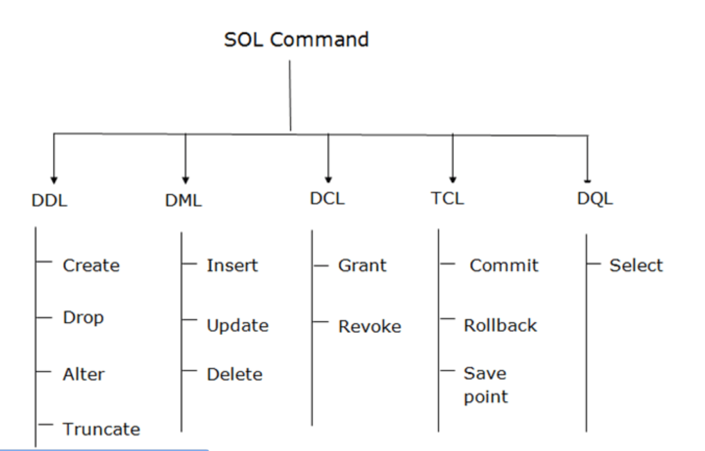

# Types of SQL Queries
---


---

## DDL
Data Definition Language 
Define and update the structure of schema
```SQL
CREATE, ALTER, DROP, TRUNCATE
```
---

## DML 
Data Manipulation Language
Update data inside the table 
```SQL
INSERT , UPDATE , DELETE
```
---

## DCL
DCL commands are used to grant and take back authority from any database user.
`GRANT , REVOKE`
```SQL
GRANT SELECT, UPDATE ON MY_TABLE TO SOME_USER, ANOTHER_USER;  
```
---

## TCL

Transaction Control Language
TCL commands can only use with DML commands like INSERT, DELETE and UPDATE only.

These operations are automatically committed in the database that's why they cannot be used while creating tables or dropping them.

Here are some commands that come under TCL:
```
COMMIT
ROLLBACK
SAVEPOINT
```

```SQL
DELETE FROM CUSTOMERS  
WHERE AGE = 25;  
COMMIT;  
```
---

## DQL

DQL is used to fetch the data from the database.

It uses only one command:

`SELECT`


Hence Total are 
`DDL DML DCL DQL TCL`