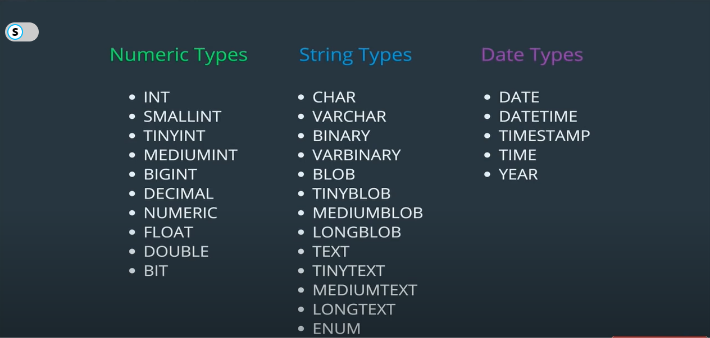

# Tables

Databases have lots of tables. Tables are made of coulmns [properties] and rows [entries] in database. 

## Data Types

Data types are specified on columns of a table which restrict the type of data that can be inserted in the database. 


---

## Creating Tables

```SQL
CREATE table_name(
    column_name data_type,
    column_name data_type
);
```
---

## Deleting tables

```SQL
DROP TABLE cats;
```
---


## Inserting Data

```SQL
INSERT INTO cats VALUES(0,'name',24);
```

**OR** 
We can specify columns in which we want to insert data and leave other columns empty. NULL will be inserted for the column whose value is not given. 

```SQL
INSERT INTO cats(id,name) VALUES(0,'Tushar');
```
- we can also insert multiple rows in one go :
```SQL
INSERT INTO cats VALUES (0,'name',24), (1, 'name2', 23), (2, 'name3', 22);
```
---

## Getting Data back 
- Gets all rows from cats table. 
```SQL
SELECT * FROM cats;
```
---


## Working with NULL column in a table

Null means not known or the value is not known.

Example: 
```SQL
+-------+-------------+------+-----+---------+-------+
| Field | Type        | Null | Key | Default | Extra |
+-------+-------------+------+-----+---------+-------+
| name  | varchar(15) | YES  |     | NULL    |       |
| age   | int         | YES  |     | NULL    |       |
+-------+-------------+------+-----+---------+-------+
```
We have a Null column when we try to see the table; 
So what happens with a table with Null set to yes is nullable values are allowed for that field. To prevent this : 

```SQL
CREATE table_name(
    column_name data_type NOT NULL,
    column_name data_type NOT NULL
);
```
Example :

```SQL
mysql> CREATE TABLE cats2(
    -> id int NOT NULL
    -> , name VARCHAR(20) NOT NULL
    -> );
```

Why should we use NOT NULL and DEFAULT together ? 
The reason is NOT NULL tells the column to not accept NULL value even if it is being inserted explicitly. 
---

## Default values

```SQL
mysql> CREATE TABLE cats2(
    -> id int NOT NULL DEFAULT 0
    -> , name VARCHAR(20) NOT NULL DEFAULT 'UNAMED'
    -> );

mysql> CREATE TABLE cats3(
    -> id int NOT NULL DEFAULT 0,
    -> name VARCHAR(20) NOT NULL DEFAULT 'unnamed'
    -> );
Query OK, 0 rows affected (0.03 sec)

mysql> desc cats3;
+-------+-------------+------+-----+---------+-------+
| Field | Type        | Null | Key | Default | Extra |
+-------+-------------+------+-----+---------+-------+
| id    | int         | NO   |     | 0       |       |
| name  | varchar(20) | NO   |     | unnamed |       |
+-------+-------------+------+-----+---------+-------+
```
---

## Working with KEYS

We can have redundant data and there can be no way to uniquely identify one from the other. So in order to separate two different rows we need to assign something unique like an id. 

And that is what we call a PRIMARY KEY. 
It is basically a unique identifier for a row. 

```SQL
mysql> CREATE TABLE unique_cats(
    -> id int NOT NULL PRIMARY KEY,
    -> name VARCHAR(20) NOT NULL DEFAULT 'unnamed'
    -> );
Query OK, 0 rows affected (0.03 sec)

mysql> desc unique_cats;
+-------+-------------+------+-----+---------+-------+
| Field | Type        | Null | Key | Default | Extra |
+-------+-------------+------+-----+---------+-------+
| id    | int         | NO   | PRI | NULL    |       |
| name  | varchar(20) | NO   |     | unnamed |       |
+-------+-------------+------+-----+---------+-------+
```

**OR**

```SQL
mysql> CREATE TABLE unique_cats(
    -> id int NOT NULL,
    -> name VARCHAR(20) NOT NULL DEFAULT 'unnamed',
    -> PRIMARY KEY(id)
    -> );
```
---


## AUTO _INCREMENT and UNIQUE

```SQL
 CREATE TABLE unique_cats2(
    -> id int NOT NULL PRIMARY KEY AUTO_INCREMENT,
    -> name VARCHAR(20) NOT NULL DEFAULT 'unnamed' UNIQUE
    -> );

+-------+-------------+------+-----+---------+----------------+
| Field | Type        | Null | Key | Default | Extra          |
+-------+-------------+------+-----+---------+----------------+
| id    | int         | NO   | PRI | NULL    | auto_increment |
| name  | varchar(20) | NO   | UNI | unnamed |                |
+-------+-------------+------+-----+---------+----------------+
```

So auto increment basically increases the id on its own whenever new row is inserted. 
and unique key says that each row should have this cloumn value unique. 

---

## ALTER TABLE SCHEMA
1. Adding a column
```SQL
ALTER TABLE employees ADD COLUMN job_type VARCHAR(50) NOT NULL DEFAULT 'Unassigned';
```
2. Dropping a column
```SQL
ALTER TABLE employees DROP COLUMN job_type ;
```

3. Modifying a Table
```SQL
ALTER TABLE employees MODIFY COLUMN firstname VARCHAR(50) UNIQUE ;
```

4. Dropping a PRIMARY KEY 
```SQL
ALTER TABLE employee DROP PRIMARY KEY;
```
Then the primary constraint will be removed and then can be removed as normal column. 

To add a primary key
``` SQL
ALTER TABLE employee ADD PRIMARY KEY(id);
```

# FOREIGN KEY

A foreign key in a table is basically a primary key in another table. 
The table with the foreign key is called the child table, and the table with the primary key is called the referenced or parent table.
- DURING CREATE
```SQL
CREATE....(
    FOREIGN KEY (column_name) REFERENCES tablename(column name); 
)
```
- DURING ALTER
```SQL
ALTER TABLE students ADD FOREIGN KEY (course_selected) REFERENCES courses(id);
```

- During deletion of data from parent table we first need to delete the child data which is using it cause if we directly delete the parent data or the id which is being used as a foreign key in another table then the childs table rows become invalid. 


## Copying a table

```SQL
CREATE TABLE students_latest as SELECT * FROM students; 
```

It will create table just like students with all data and everything but no constraints. 
mysql> desc students_latest;
```SQL
+------------------------+-------------+------+-----+-------------------+-----------------------------+
| Field                  | Type        | Null | Key | Default           | Extra                       |
+------------------------+-------------+------+-----+-------------------+-----------------------------+
| id                     | int(11)     | NO   |     | 0                 |                             |
| firstname              | varchar(20) | NO   |     | NULL              |                             |
| lastname               | varchar(20) | NO   |     | NULL              |                             |
| email                  | varchar(15) | NO   |     | NULL              |                             |
| middlename             | varchar(20) | YES  |     | NULL              |                             |
| alternate_phone_number | varchar(15) | YES  |     | NULL              |                             |
| phone_number           | varchar(15) | YES  |     | NULL              |                             |
| enrollment_date        | timestamp   | NO   |     | CURRENT_TIMESTAMP | on update CURRENT_TIMESTAMP |
| years_of_exp           | int(11)     | YES  |     | NULL              |                             |
| student_company        | varchar(20) | YES  |     | NULL              |                             |
| batch_date             | varchar(20) | YES  |     | NULL              |                             |
| source_of_joining      | varchar(30) | NO   |     | NULL              |                             |
| location               | varchar(30) | NO   |     | NULL              |                             |
| course_selected        | int(11)     | NO   |     | 0                 |                             |
+------------------------+-------------+------+-----+-------------------+-----------------------------+
14 rows in set (0.00 sec)

mysql> desc students;
+------------------------+-------------+------+-----+-------------------+-----------------------------+
| Field                  | Type        | Null | Key | Default           | Extra                       |
+------------------------+-------------+------+-----+-------------------+-----------------------------+
| id                     | int(11)     | NO   | PRI | NULL              | auto_increment              |
| firstname              | varchar(20) | NO   |     | NULL              |                             |
| lastname               | varchar(20) | NO   |     | NULL              |                             |
| email                  | varchar(15) | NO   | UNI | NULL              |                             |
| middlename             | varchar(20) | YES  |     | NULL              |                             |
| alternate_phone_number | varchar(15) | YES  |     | NULL              |                             |
| phone_number           | varchar(15) | YES  |     | NULL              |                             |
| enrollment_date        | timestamp   | NO   |     | CURRENT_TIMESTAMP | on update CURRENT_TIMESTAMP |
| years_of_exp           | int(11)     | YES  |     | NULL              |                             |
| student_company        | varchar(20) | YES  |     | NULL              |                             |
| batch_date             | varchar(20) | YES  |     | NULL              |                             |
| source_of_joining      | varchar(30) | NO   |     | NULL              |                             |
| location               | varchar(30) | NO   |     | NULL              |                             |
| course_selected        | int(11)     | NO   | MUL | 0                 |                             |
+------------------------+-------------+------+-----+-------------------+-----------------------------+
14 rows in set (0.00 sec)
```