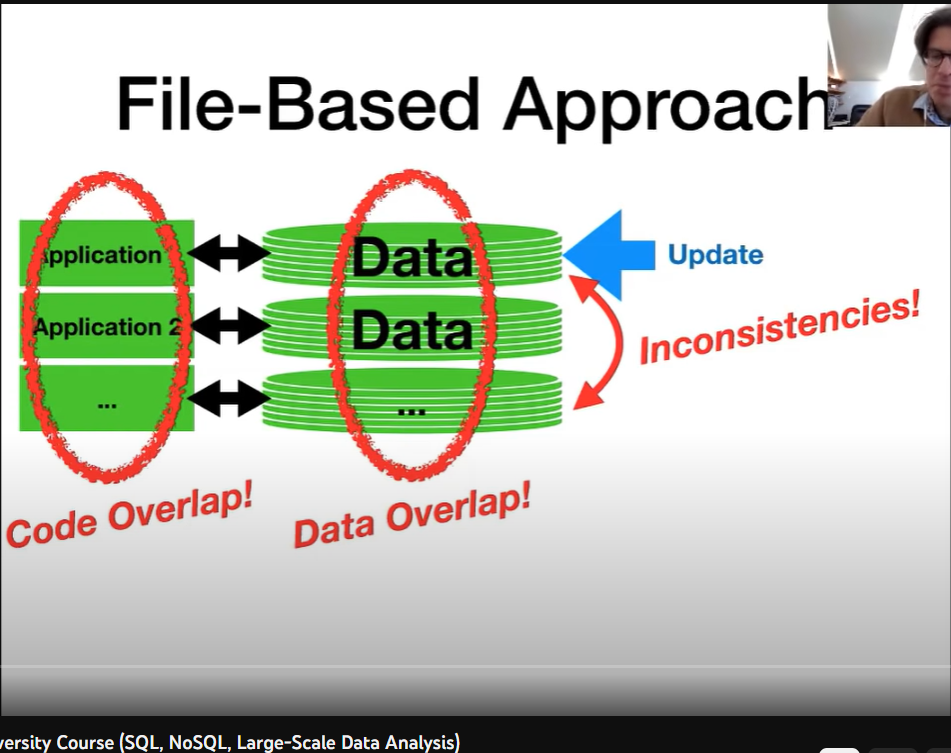
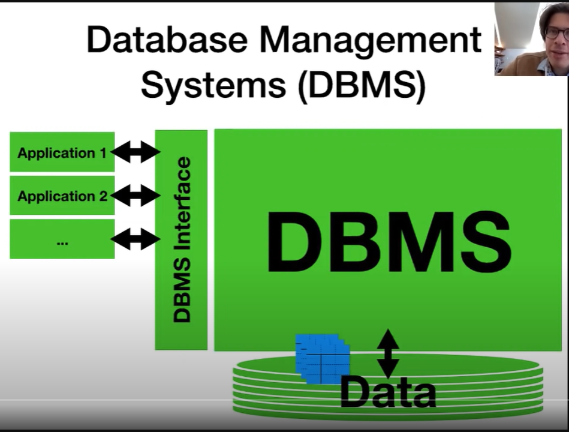
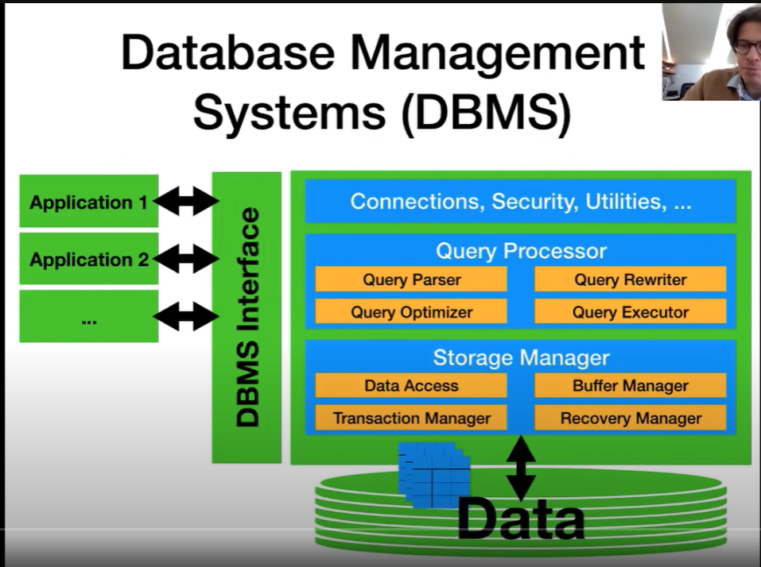

# Database Management Systems

A database is a collection of data, typically describing the activities of one or more
related organizations. For example, a university database might contain information
about the following:  
- _Entities_ such as students, faculty, courses, and classrooms.
- _Relationships_ between entities, such as students’ enrollment in courses, faculty
teaching courses, and the use of rooms for courses.

A **database management system**, or **DBMS**, is software designed to assist in
maintaining and utilizing large collections of data.  

The alternative to using a DBMS is to use adhoc approaches that do not carry over from one application to another; for example,
to store the data in files and write application-specific code to manage it.

## Describing and storing data in a database 
The user of a DBMS is ultimately concerned with some real-world enterprise, and the
data to be stored describes various aspects of this enterprise. For example, there are
students, faculty, and courses in a university, and the data in a university database
describes these entities and their relationships.

A **data model** is a collection of high-level data description constructs that hide many
low-level storage details. A DBMS allows a user to define the data to be stored in
terms of a data model. Most database management systems today are based on the
relational data model.  
A widely used semantic data model called the entity-relationship (ER) model allows
us to pictorially denote entities and the relationships among them.

## History
In ancient there was no use of DBMS and the file-system approach was followed.  
Each application manages it's own data in it's own format. If these applications are running in a same 
organization and if the data is being stored independently it means we are wasting data
space because we are storing same data redundantly. 

Also we might introduce inconsistency along different stores. 
There's also code overlap scenario when we wnat to have some functionality in all our applications
 

## DBMS
One system managing all the data in an organizing for a certain domain and then these applications
access the data via these DBMS unified interface. 

We deal with relational data mostly, Relational data is simply collection of tables.

### Components of DBMS 
