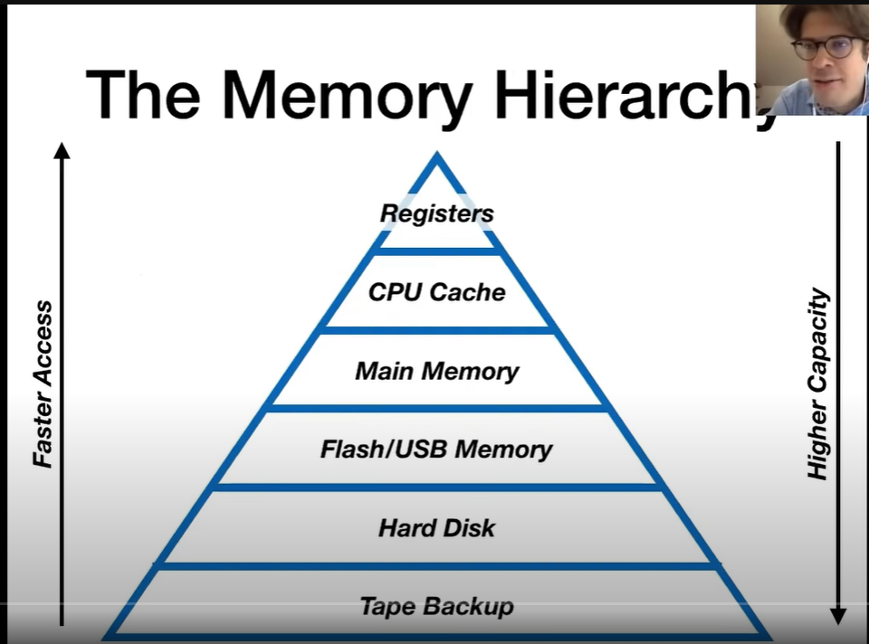

# Hardware 

---

The higher in the pyramaid has faster access and lower storage and as we come down the storage increases but the access time increases. 

The part below the main memory are non-volatile whereas above that are volatile. i.e they will lost data once the system is turned off. 