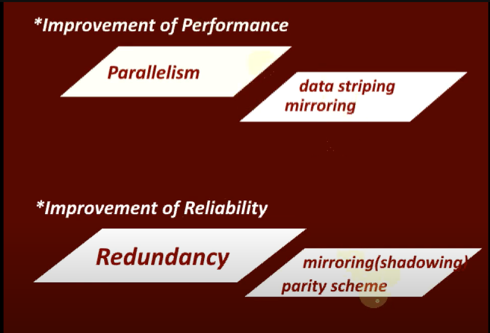

## RAID

RAID Is basically redundant array of independent Disks, in which several disks act as a single logical disk.

Why do we use RAID instead of a single large disk? 
In past Large disks were expensive so small cheap tasks were more feasible but today they are not used for their cost effectiveness but used for 
1. Improvement of Perfromance 
2. Improvement of Reliability or both. 

RAID is used for improvement of performance and reliability. 

### Improvement of Reliability using RAID: 

Reliability in RAID is achieved using redundancy i.e instead of single disks since we have multiple disk we can keep ONE OR more disks as redundant disk which can keep some redundant information or some extra information with the help of which we can recover data in case some of our data is lost. 
It is achieved mainly using two methods: 
1. Mirroring/shadowing : 

When some data has to be written on a disk the same data is replicated on another disk. So if any of the disk fails we can access the data from the mirror disk.

2. Parity scheme 
Here the redundant disk contains the parity information with the help of which lost information can be constructed. 

### Improvement of performance 

Improvement of performance in RAID is achieved by using parallelism and parallelism is mainly achieved by using data striping. 
In above picture striping is done at block level. We divide the data into blocks.

Similarly striping can be done at bit level too. 

byte-level: 

- How parallelism is achieved using Data striping ?
since we have multiple disks we can access these disks in parallel fashion for example: 
While writing to disk A we can write to disk B as well as Disk C 

As a result the write operation can be executed in a faster way thus improved write performance. 
similarly we can achieve improved read performance too. 
We can read block 1 from Disk A and parallely read block 2 from Disk B.
Thus data striping helps in achieveing parallelism and peformace thus improved. 

parallelism is also achieved using mirroring. 

Based on different combinations of above like data striping can be done [bit,byte,block Level] and parity scheme has option for single parity disk or distributed parity disk different RAID levels are figured out. 

In a RAID system, the disk array is partitioned into reliability groups, where
a reliability group consists of a set of data disks and a set of check disks. The number
of check disks depends on the RAID level chosen.

