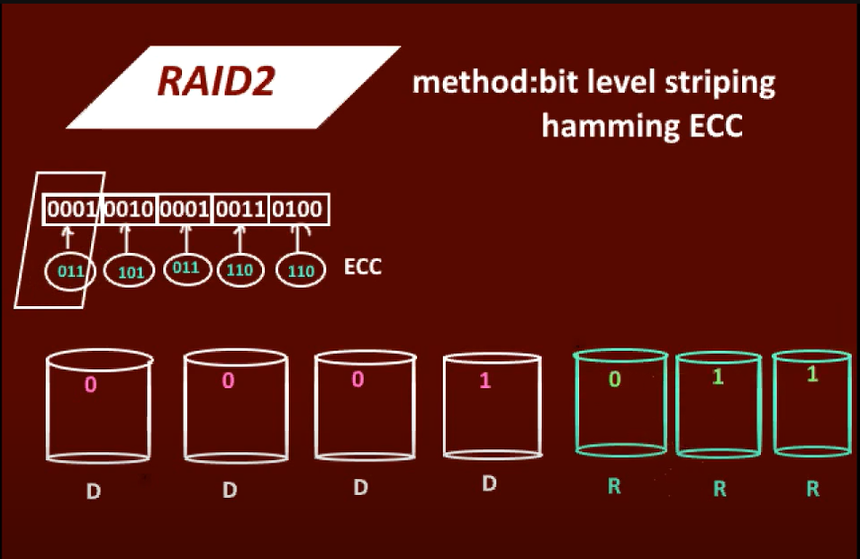
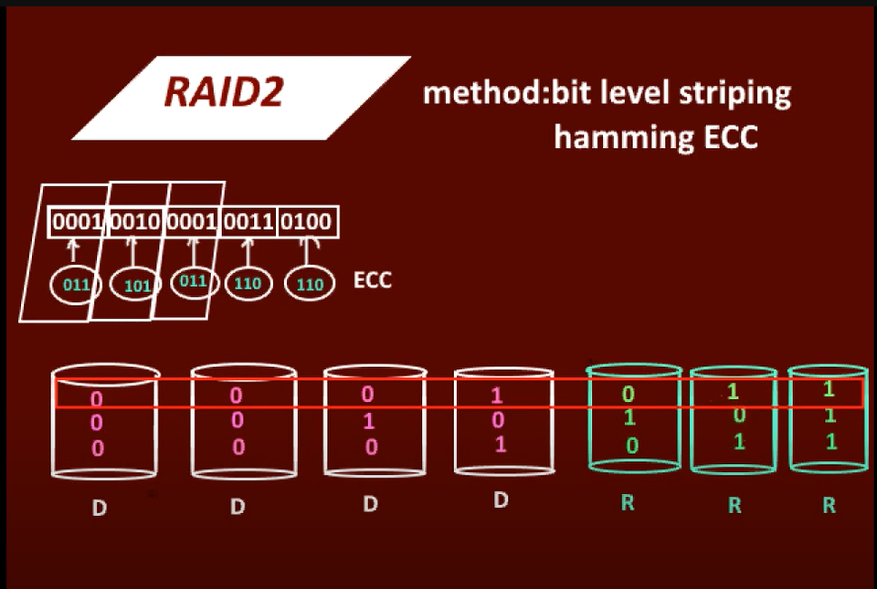

# RAID LEVEL 2 : Error Correcting codes

Raid level 2 uses bit level striping with hamming error correcting code. 
In RAID Level 2, the striping unit is a single bit. The redundancy scheme used
is Hamming code. In our example with four data disks, only three check disks
are needed. In general, the number of check disks grows logarithmically with
the number of data disks.

In raid2 The hamming code works is actually to acknowledge that a disk has failed and 
identify which disk has failed. But in practical system we will come to know which disk has failed
the disk controller will itself acknowldege it. so for just recovering or rebuilding data this much parity is not needed and thus just a overhead. 
Example: 
Suppose we have a data word 
0001 and using even parity scheme parity would be 1 [Number of 1's to make 1 count even].
so now if _001 if one bit misses and we have parity as 1 which implies single one added to this data word would make count of 1's even so the missing bit cannot be 1 hence 0. In this way with a single bit we can calculate the lost data and use of more parity disks just becomes an overhead. 

Striping at the bit level has the implication that in a disk array with D data
disks, the smallest unit of transfer for a read is a set of D blocks. Therefore,
Level 2 is good for workloads with many large requests, since for each request,
the aggregated bandwidth of all data disks is used. But RAID Level 2 is bad
for small requests of the size of an individual block for the same reason. (See
the example in Section 9.2.1.) A write of a block involves reading D blocks
into main memory, modifying D + C blocks, and writing D + C blocks to
disk, where C is the number of check disks. This sequence of steps is called a
read-modify-write cycle
