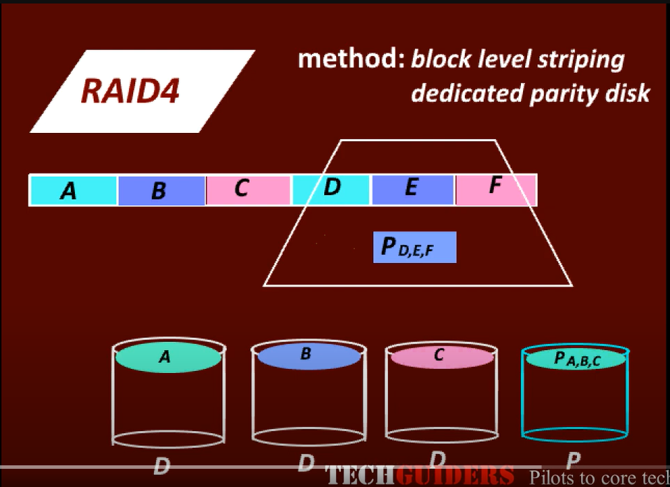

# RAID Level 4 : Blcok Interleaved property

It uses block level striping with a dedicated parity disk. 
The data to be written on to the disk will be divided into blocks to be striped across multiple disks. 

About the performance, since we are using block level striping there should be improved performance. 

Suppose we have two read request one for block A and another for Block B hence while disk1 serves for block A disk2 can serve for Block B. 

Hence two read requests can be entertained at the same time. 

Similar case for write requests but what happens is if we try updating the parity simultaneously which resides in the same disk there will be a bottle neck. 