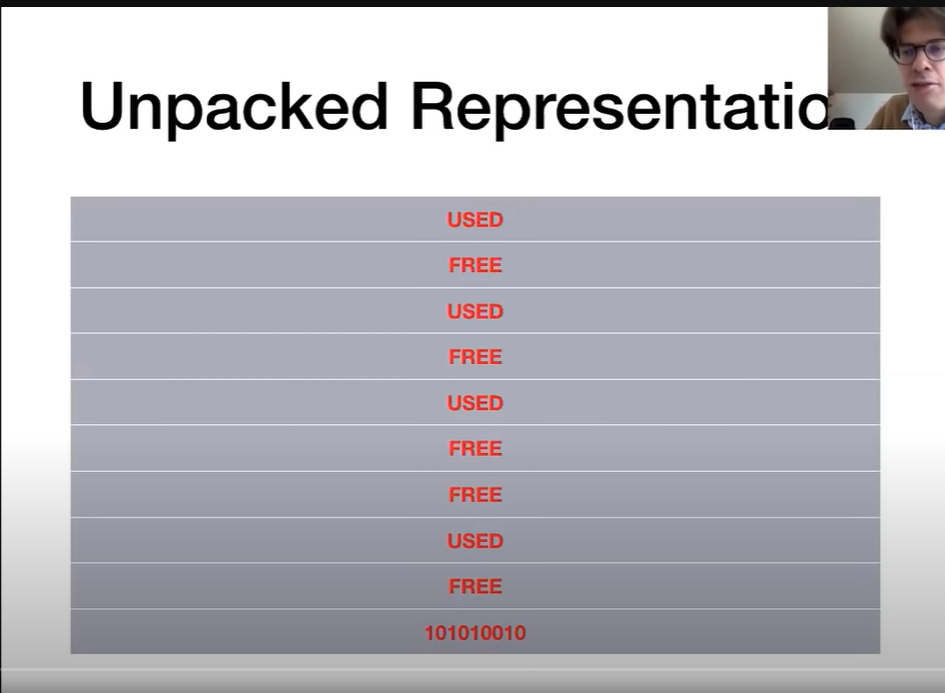

# Data Storage Format 

## Tables as Files

- Table schema is stored in Database catalog. It is the central repository of the database where it maintains certain metadata. 
- Table content is stored as collection of pages(file). Essentially a chunk of data stored in a certain location.  
Data pages are fundamentally the basic unit of storage. 
- Each page typically stores a few KB of data. The size of that page is chosen in order to maximize the retrieval efficiency from the correspondent storage device. 

To store data we have multiple pages that stores multiple rows.

- In order to track which pages store information about which table we need to have a system. so all pages that contain data from the same table are called files. So there can be multiple ways of doing that : 

1. We store those pages that belong to a same table are stored as doubly linked lists. 
 - Each page contains pointers to the next and previous page. 
 - To retrieve data we need to search through all the associated pages. 
 - Reference to header page stored in catalog. 
 - In order to make things more efficient we can maintain two lists to store pages that are full[cannot add more data ] and partially empty.  

 

2. Directory[collection of pages] to pointers with pages

So we have directory pages on the left hand side and each of them contains pointers to actual data pages. 
and the directory itself can be stored as linked list. The header page whose address can be found in the database catalog. 
And the directory pages would also contain some metadata about the pages consisting of how much space is left in a certain page. 

In this system the data pages do not store pointers to next or previous pointer instead pointers are saved in the directory itself. 

## Partitioning 

A page can contain many rows so we need to partition into different section that stores different rows. 
- Pages are divided into slots. Each slot stores one record (row).
So in order to refernce a particular row we need the page Id and the slot id. 

There are multiple ways to divide pages into slots. And it depends if the records are fixed length or variable length. 

For dtataypes such as integer postgres already has fixed bytes that it takes which is 4 bytes. hence this is a fixed length record whereas a text field may not have fixed size and thus can be called variable length record. 

hence if the table contains even a single of variable length of data type then it may require different space for each record. 

1. Fixed Length 

So in this case we know apriori the number of bytes required for each slot. And it's easier to pratition the only thing we need to keep track of is which slots are used. 
Theres multiple ways of doing that : 
    1.  Packed Representation
    
    The last row in this represents the number of used slots. 
      Packed representations uses only consecutive slots. 
      In this case we then need to keep track of is the number of slots being used. 
    2.  Unpacked Representation
    
    The last row in this represents the bitmap.
        allows unused slots in between. 
        If allowed for data to be stored like this then we need a bitmap to keep track of used slots.

Problem with using a packed representation is that we we will have to shift the slot once one of them is delted to keep the packed representation and also update the same in the catalog directory. 

2. Variable Length Records 

Now if we have text as entry the size would vary for each row. 
Each page would contain directory for used slots and stores first byte and length of slots
